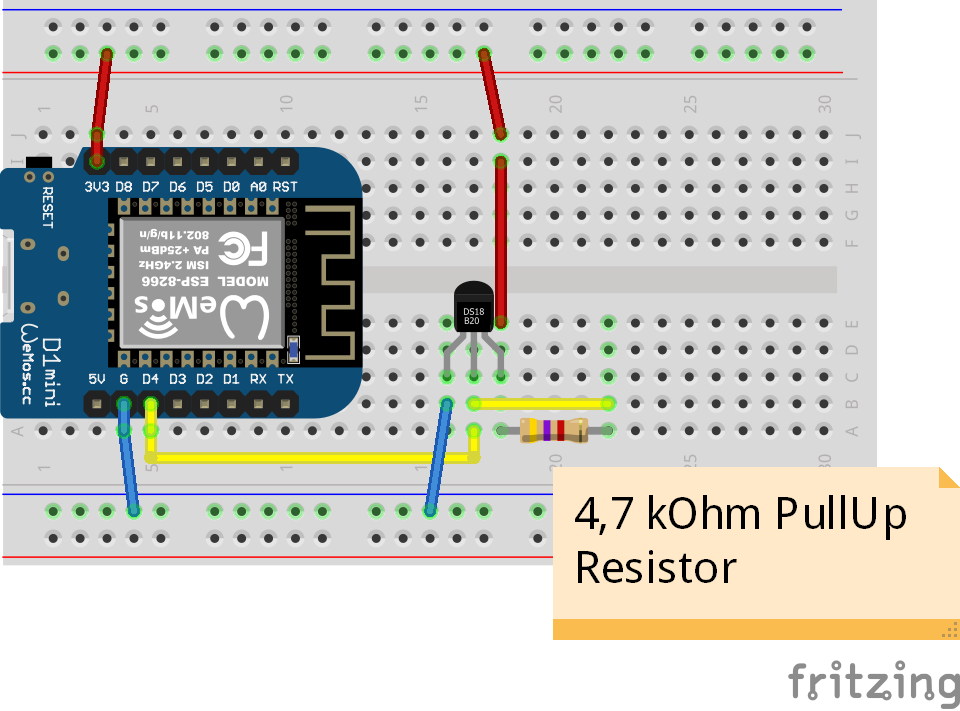
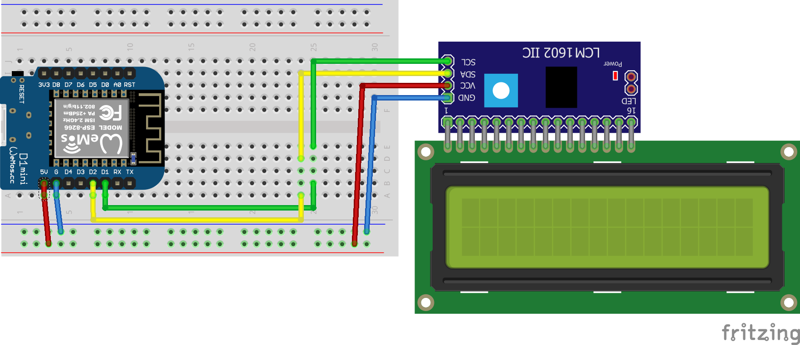

# MQTT Workshop for Wemos D1

This is a simple workshop that shows how to use MQTT on the famous Wemos D1.

We will build up a publisher that has a DS18B20 as digital temperature sensor and a receiver that will print the reading on a I²C LCD and switch on the light up the built-in LED if the temperature rises above 30 °C.

## You need...

### Software

[Arduino IDE](https://www.arduino.cc/en/Main/Software) and the following libraries:

 * [Arduino core for ESP8266 WiFi chip](https://github.com/esp8266/Arduino)
 * [WiFiManager](https://github.com/tzapu/WiFiManager)
 * [PubSubClient](https://pubsubclient.knolleary.net/) for MQTT
 * [OneWire](https://www.pjrc.com/teensy/td_libs_OneWire.html)
 * [DallasTemperature](https://github.com/milesburton/Arduino-Temperature-Control-Library)
 * [hd44780](https://github.com/duinoWitchery/hd44780)

### Hardware

 * 2x Wemos D1
 * 1x Maxim DS18B20 (OneWire temperature sensor)
 * 1x 4,7 kOhm Resistor
 * 1x HD44780 16x02 LCD with Maxim I2C expander
 * Breadboards, Jumper Wires

## Hardware Setup

### Temperature Publisher

### Temperature Receiver

## Software Setup

 1. Install [MQTT-Temperature-Publisher](MQTT-Temperature-Publisher) on the Wemos with the DC18B20
 2. Install [MQTT-Temperature-Receiver](MQTT-Temperature-Receiver) on the Wemos with the LCD

## Resources

 * [Brief overview over MQTT](https://www.slideshare.net/BryanBoyd/mqtt-austin-api)
 * [JavaFX based MQTT Client](http://www.mqttfx.org/)

## License

Hell yeah, it's [Open Source](LICENSE)!